  
  
  
  
  
   
  
  
  
  
  
  

# Hi

I entered the world of computing in **1997**, writing small programs as a kid in Cuba.  Since then, I’ve turned that passion into a career spanning **software engineering, entrepreneurship, and research**. 

> [!NOTE]
> ⚡ *Three decades in tech and still learning, still building, still sharing.* 

 

<h3 align="center">Contribution Snake</h3>

  

GitHub Contribution Chart

    

```mermaid
gantt
    dateFormat  YYYY
    axisFormat  %Y
    title  Career Timeline (1997–Present)
    todayMarker on

    section Professional Roles
    Programmer                  :done,   1997, 2010
    Software Engineer           :active, 2010, 2025
    Software Architect          :active, 2012, 2025
    Project Manager             :active, 2015, 2025

    section Education & Service
    High School (Exact Sciences) :done, 2001, 2004
    Military Service (Army IT)   :done, 2004, 2005
    B.Sc. Software Eng. (CUJAE)  :done, 2005, 2010

    section Entrepreneurship
    Co-founder — Apretaste!     :active, 2011, 2025
    Founder — Divengine         :active, 2011, 2025

    section Industry Experience
    Software Engineer — Magaya  :active, 2020, 2025

    section Key Milestones
    First Drupal Websites       :milestone, 2005, 0y
    Launch of Apretaste!        :milestone, 2011, 0y
    Start with Python           :milestone, 2011, 0y
    Joining Magaya              :milestone, 2020, 0y
    Entering Odoo Ecosystem     :milestone, 2024, 0y

    section Core Technologies
    BASIC, Pascal, C            :done,   1997, 2004
    JavaScript / TypeScript     :active, 2003, 2025
    C++ / C# / Java             :active, 2005, 2025
    PHP + Drupal + WordPress    :active, 2005, 2025
    PostgreSQL / SQL            :active, 2005, 2025
    Python / Prolog             :active, 2011, 2025
    Node.js / React / Vue       :active, 2016, 2025
    Odoo                        :active, 2024, 2025

    section Disciplines & Tools
    Office Tools (Excel, Access, VBA) :active, 2000, 2025
    Operations Research         :active, 2000, 2025
    Software Eng. (RUP, UML)    :active, 2006, 2025
    Artificial Intelligence     :active, 2006, 2025
    BPM & BPMN                  :active, 2007, 2025
    Linux / GitHub              :active, 2007, 2025
```

## Let’s Connect  

- [rafageist.com](https://rafageist.com)  
- [divengine.com](https://divengine.com)  
- [LinkedIn](https://linkedin.com/in/rafageist)  
- [Twitter/X](https://twitter.com/rafageist)  
- rafageist@hotmail.com  

## Timeline Highlights  

- 🏆 **2025** – 5 years at [Magaya](https://magaya.com) as Software Engineer  
- 🚀 **2011** – Founded [Divengine Software Solutions](https://divengine.com) 
- 👨‍💻 **2011** – Co-founded [Apretaste!](https://apretaste.net), bringing internet access to Cuba  
- 🎓 **2010** – B.Sc. in Software Engineering (Technological University of Havana)  
- 🏅 **2009** – ACM-ICPC programming contest  
- 💻 **1997** – First steps into programming  

## Featured Repositories  

- ✍️ [**blog-reflections**](https://github.com/rafageist/blog-reflections) – Versioned notebook of personal reflections on time, logic, information, and systems. All content lives in the Wiki. Released periodically as a PDF.  

- 🧩 [**stage-design-pattern**](https://github.com/rafageist/stage-design-pattern) – A behavioral design pattern for structured, asynchronous communication between objects with explicit Speaker and Listener roles, ensuring scalability, maintainability, and clear architectural practices.

- 🔄 [**process-design-pattern**](https://github.com/rafageist/process-design-pattern) – Behavioral Design Pattern focused on managing the behavior and interactions of software processes. Related to patterns dealing with workflows, states, and decisions but introduces its own unique methodology. 

- 🏗️ [**abcd-architecture**](https://github.com/rafageist/abcd-architecture) – Architecture designed to demonstrate how to structure applications with clear responsibilities, leveraging a modular and scalable approach.

- ⚡ [**proposal-universal-catch-and-when**](https://github.com/rafageist/proposal-universal-catch-and-when) – Proposal to extend error handling in ECMAScript by allowing any block to have multiple "catch" and "finally" clauses. A new "when" clause is introduced for conditional errors and the "catch" body is allowed to be optional. 

